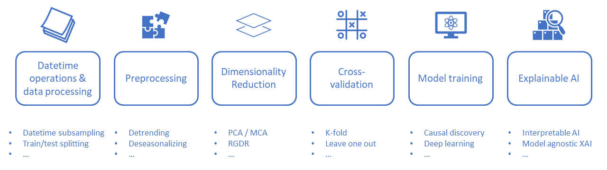

# s2spy

A high-level python package integrating expert knowledge and artificial intelligence to boost (sub) seasonal forecasting.

[](https://github.com/AI4S2S/ai4s2s)
[](https://github.com/AI4S2S/s2spy)
[](https://fair-software.eu)
[](https://github.com/AI4S2S/s2spy/actions/workflows/build.yml)
[](https://github.com/AI4S2S/s2spy/actions/workflows/sonarcloud.yml)
[](https://sonarcloud.io/dashboard?id=AI4S2S_ai4s2s)

## Why s2spy?
Producing reliable (sub) seasonal (S2S) forecasts with machine learning techniques remains a huge challenge. Currently, these data-driven S2S forecasts generally suffers from a lack of trust because:
- Intransparent data processing and poorly reproducible scientific outcomes
- Technical pitfalls related to machine learning based predictability (e.g. overfitting)
- Black-box methods without sufficient explanation

To tackle these challenges, we build this open-source, high-level python package, `s2spy`. It provides an interface between artificial intelligence and expert knowledge, to boost predictability and physical understanding of S2S processes. By implementing optimal data-handling and parallel-computing packages, it can efficiently run across different Big Climate Data platforms. Key components will be explainable AI and causal discovery, which will support the classical scientific interplay between theory, hypothesis-generation and data-driven hypothesis-testing, enabling knowledge-mining from data.

This tool will be a community effort. It can help us achieve trustworthy data-driven forecasts by providing the user with:
- Transparent and reproducible analyses
- Best practices in model verification
- Understanding of the sources of predictability

## Installation
[](https://pypi.python.org/project/s2spy/)
[](https://pypi.python.org/project/s2spy/)

To install the latest release of s2spy, do:
```console
python3 -m pip install s2spy
```

To install the in-development version from the GitHub repository, do:

```console
git clone https://github.com/AI4S2S/s2spy.git
cd s2spy
python3 -m pip install .
```

### Configure the package for development and testing
The testing framework used here is [pytest](https://pytest.org). Before running the test, the package need to be installed and configured as via the command:

```py
pip install -e .
```
or
```py
python setup.py develop
```

## Getting started
`s2spy` provides end-to-end solutions for machine learning (ML) based S2S forecasting.



### Datetime operations & Data processing
In a typical ML based S2S project, the first step is always data processing.  A calendar-based datetime operation module is implemented to help the user prepared their data. For instance, if a user is looking for predictors for winter climate at seasonal timescale (~180 days), a `AdventCalendar` can be used to prepare their data:

```py
calendar = s2spy.time.AdventCalendar(anchor=(11, 30), freq='180d')
calendar = calendar.map_years(2020, 2021)
calendar
>>>    i_interval                 (target) 0                         1
>>>    anchor_year
>>>    2021         (2021-06-03, 2021-11-30]  (2020-12-05, 2021-06-03]
>>>    2020         (2020-06-03, 2020-11-30]  (2019-12-06, 2020-06-03]
```

`s2spy` works with `xarray` data. Now, the user can load their data and easily resample their data to the desired timescales configured in the calendar:

```py
calendar = calendar.map_to_data(input_data)
bins = s2spy.time.resample(calendar, input_data)
>>>       anchor_year  i_interval                  interval  mean_data  target
>>>     0        2020           0  (2020-06-03, 2020-11-30]      275.5    True
>>>     1        2020           1  (2019-12-06, 2020-06-03]       95.5   False
>>>     2        2021           0  (2021-06-03, 2021-11-30]      640.5    True
>>>     3        2021           1  (2020-12-05, 2021-06-03]      460.5   False
```

Depending on their tasks, the user can choose their desired calendar from a collection of different type of calendars, to process their data (e.g. `MonthlyCalendar` and `WeeklyCalendar`).

### Dimensionality reduction
In `s2spy`, users can perform dimensionality reduction on their data. For instance, to perform the Response Guided Dimensionality Reduction (RGDR), the user only need to configure the RGDR operator and fit it to a precursor field. Then, this cluster can be used to tranform the data to the reduced clusters:
```py
rgdr = RGDR(eps_km=600, alpha=0.05, min_area_km2=3000**2)
rgdr.fit(precursor_field, target_timeseries)
clustered_data = rgdr.transform(precursor_field)
_ = rgdr.plot_clusters(precursor_field, target_timeseries, lag=1)
```


### Cross-validation
More information will follow soon.

### Train a model
More information will follow soon.

### eXplanable AI (XAI) analysis
More information will follow soon.

## Tutorials
TODO: add link to all tutorials and add link to api from readthedoc.

## Documentation
[](https://ai4s2s.readthedocs.io/en/latest/?badge=latest)

For detailed information on using `s2spy` package, please visit the [documentation page](https://ai4s2s.readthedocs.io/en/latest/) hosted at Readthedocs.

## Contributing

If you want to contribute to the development of s2spy,
have a look at the [contribution guidelines](docs/CONTRIBUTING.md).

## How to cite us
<!-- [](https://www.research-software.nl/software/s2spy) -->
<!-- [](https://doi.org/<replace-with-created-DOI>) -->

<!--TODO: add links to zenodo and rsd. -->
More information will follow soon.

## Credits

This package was created with [Cookiecutter](https://github.com/audreyr/cookiecutter) and the [NLeSC/python-template](https://github.com/NLeSC/python-template).
